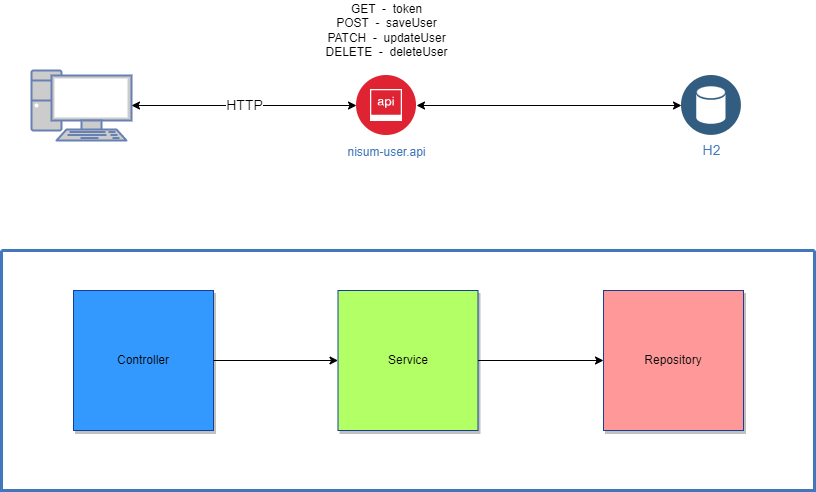

# Nisum.User.Api

Proyecto de ejercicio en Java. CRUD de Usuario



## Instrucciones

- Clonar este repositorio
- Asegúrese de estar usando JDK 1.8 y Maven 3.x

### IntelliJ IDEA
- Abra IntelliJ IDEA y seleccione Archivo > Abrir... .
- Elija el directorio nisum.user.api y haga clic en Aceptar .
- Seleccione Archivo > Estructura del proyecto... y asegúrese de que el SDK del proyecto.
- Abra la vista de Maven con View > Tool Windows > Maven .
- En la vista de Maven, ejecute la aplicación.

### Línea de comando
- Coloquese en el directorio raíz del proyecto
- Ejecute alguno de los comandos

```
        mvn exec:java -Dexec.mainClass=com.nisum.user.api.NisumUserApiApplication        
or
        mvn spring-boot:run
or
        java -jar target/nisum.user.api-0.0.1-SNAPSHOT.jar
```
- Para saltear el token JWT, ejecute en el profile local. Ejecute 
```
        mvn exec:java -Dexec.mainClass=com.nisum.user.api.NisumUserApiApplication -Dspring.profiles.active=local        
or
        mvn spring-boot:run -Drun.arguments="spring.profiles.active=local"
or
        java -jar -Dspring.profiles.active=local target/nisum.user.api-0.0.1-SNAPSHOT.jar
```

## Contenido

- JUnit en las capas web, service y persistencia.
- Javax Validation para la validación de los "request".
- Integración con Hibernate.
- H2 Database.
- Spring Actuator.
- Generación y autentificación de token JWT.
- Spring Security para securizar los endpoints usando token JWT. Si desea saltar esta parte, activar el profile local.

## Pruebas

- Puede realizar las pruebas con POSTMAN, importe el archivo NISUM-USER.postman_collection.json

### Para probar con CURL :
Para generar el token de acceso, ejecute : 
```
curl http://localhost:8090/nisum-user/token
```
SaveUser
```
curl -d @src/test/resources/json/saveUserRequest.json -H "Content-Type: application/json" -X POST http://localhost:8090/nisum-user/api/v1
```
FindUserById
```
curl http://localhost:8090/nisum-user/api/v1/214c3e68-9fae-43a9-b53d-86b9784179da
```
UpdateUser
```
curl -d @src/test/resources/json/updateUserRequest.json -H "Content-Type: application/json" -X PATCH http://localhost:8090/nisum-user/api/v1/214c3e68-9fae-43a9-b53d-86b9784179da
```
DeleteUser
```
curl -X DELETE http://localhost:8090/nisum-user/api/v1/214c3e68-9fae-43a9-b53d-86b9784179da
```